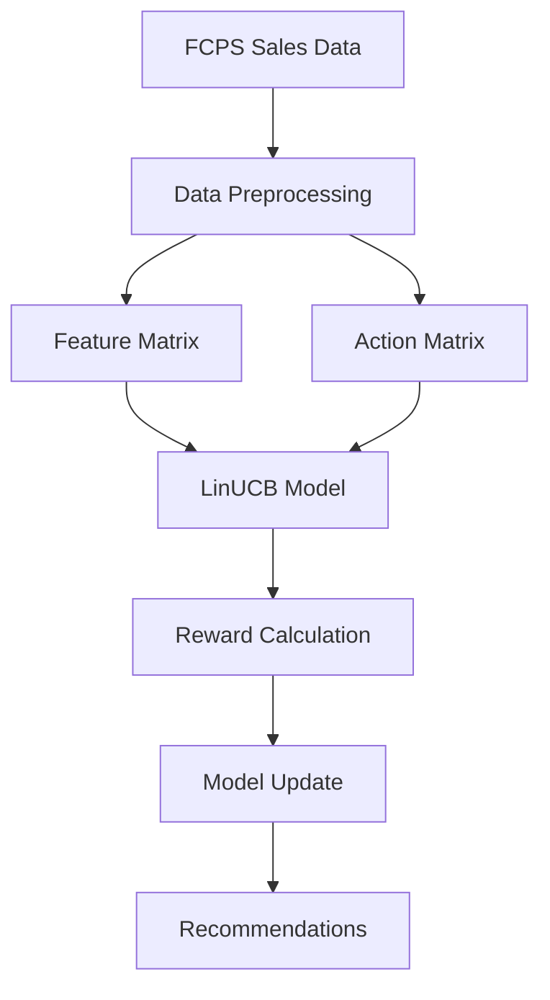

Note: Use Markdown Cheat Sheet download in the directory as needed.

- Useful links
  - https://github.com/im-luka/markdown-cheatsheet

## Sirisha Ginnu Weekly Report
---

## Date: Week 1 - September 10 - September 17, 2025

- Topics of discussion
    - Studied Reinforcement Learning framework with emphasis on Contextual Multi-Armed Bandits (CMAB)
    - Reviewed project requirements and FCPS dataset structure
    - Set up repository structure and initial project organization
    - Created data directory structure for FCPS sales and nutrition data
    - Initial exploration of dataset schema and data types

- Action Items:
* [x] Created repository structure (`fall-2025-group8`) 
* [x] Set up folder structure for Components, data, and tests
* [x] Created initial data directory (`src/data/`)
* [x] Added EDA script and dataset README
* [x] Review CMAB algorithm papers (LinUCB, Thompson Sampling)

---

## Date: Week 2 - September 17 - September 24, 2025

- Topics of discussion
    - Implemented data loading and preprocessing pipelines
    - Created mapping utilities for sales to nutrition data
    - Built EDA workflows to understand data distributions
    - Explored meal popularity patterns and participation trends
    - Identified data cleaning requirements (missing values, duplicates)

- Action Items:
* [x] Added EDA script (`src/data/eda.py`) and notebook (`src/data/eda.ipynb`)
* [x] Created mapping scripts (`src/data/mapping.py`, `src/data/1.mapping.py`)
* [x] Added inverse mapping utilities for nutrition to sales conversion
* [x] Generated initial data exploration visualizations
* [x] Added weekly progress report template

- **_Code Snippet_**

```python
# src/data/mapping.py - Sales to Nutrition Mapping (Main Implementation)
import pandas as pd
import numpy as np
import re
from pathlib import Path

# Load sales and nutrition data
sales = pd.read_csv(sales_path)
nutr = pd.read_csv(nutr_path)

# Normalize text for matching
def norm(s: str) -> str:
    """Normalize text for consistent matching"""
    if pd.isna(s): return ""
    s = str(s).lower()
    s = s.replace("&", " and ")
    s = re.sub(r"\bw\/\b", " with ", s)
    s = re.sub(r"\/", " ", s)
    s = re.sub(r"[^a-z0-9\s%+]", " ", s)
    s = re.sub(r"\s+", " ", s).strip()
    return s

# Tag categories for better matching
CATEGORY_RULES = {
    "cereal": ["cereal","cheerios","chex","toast crunch","kix","krispies","corn flakes"],
    "bagel": ["bagel"],
    "cream_cheese": ["cream cheese"],
    "milk": ["milk","1%","one percent","fat free"],
    "juice": ["juice"],
    "fruit": ["apple","banana","orange","mandarin","peach","pineapple"],
    "egg": ["egg"],
    "cheese": ["cheese","american cheese","string cheese"],
    "yogurt": ["yogurt"],
    "bread": ["bread","muffin top"],
    "pancake": ["pancake"],
    "sausage": ["sausage"],
    "sandwich": ["sandwich","english muffin"],
}

def tag_categories(text: str) -> set:
    """Tag text with food categories"""
    text_n = norm(text)
    cats = set()
    for cat, kws in CATEGORY_RULES.items():
        if any(kw in text_n for kw in kws):
            cats.add(cat)
    return cats or {"uncategorized"}

# Find candidate nutrition items for a sales item
def candidates_for_sales_item(sales_item: str) -> pd.DataFrame:
    """Find nutrition candidates for a sales item using category and token matching"""
    cats = tag_categories(sales_item)
    # Filter by category
    if cats == {"uncategorized"}:
        pool = nutr
    else:
        pool = nutr[nutr["categories"].apply(lambda c: len(c & cats) > 0)]
        if len(pool) < 3:
            pool = nutr  # fallback if too few matches
    
    s_norm = norm(sales_item)
    stoks = set(s_norm.split())
    
    # Calculate matching score
    overlap = pool["token_set"].apply(lambda ts: len(ts & stoks))
    
    # Substring bonus for longer tokens
    long_tokens = [t for t in stoks if len(t) > 3]
    if long_tokens:
        regex = "|".join(map(re.escape, long_tokens))
        substr_bonus = pool["name_norm"].str.contains(regex, regex=True)
    else:
        substr_bonus = pd.Series(False, index=pool.index)
    
    cat_align = pool["categories"].apply(lambda c: len(c & cats))
    score = overlap + (2 * substr_bonus.astype(int)) + 0.5 * cat_align
    
    return pool.assign(score=score).sort_values("score", ascending=False)

# Handle composite items (e.g., "bagel with cream cheese")
def split_components(sales_item: str) -> list[str]:
    """Split composite items into components"""
    s = norm(sales_item)
    parts = re.split(r"\b(with|and|\+)\b", s)
    parts = [p.strip() for p in parts if p.strip() and p.strip() not in {"with","and","+"}]
    return parts if len(parts) > 1 else []

def aggregate_numeric(df: pd.DataFrame, method="median") -> pd.Series:
    """Aggregate nutritional values"""
    if df.empty:
        return pd.Series({c: np.nan for c in ordered_cols})
    if method == "median":
        ser = df[ordered_cols].median(numeric_only=True)
    elif method == "mean":
        ser = df[ordered_cols].mean(numeric_only=True)
    return ser.reindex(ordered_cols)

def sum_numeric(df: pd.DataFrame) -> pd.Series:
    """Sum nutritional values for composite items"""
    if df.empty:
        return pd.Series({c: np.nan for c in ordered_cols})
    return df[ordered_cols].sum(numeric_only=True).reindex(ordered_cols)

# Main mapping loop
unique_sales_items = (
    sales.groupby("description", as_index=False)["total"].sum()
         .rename(columns={"description":"sales_item","total":"sales_volume"})
)

records = []
for _, row in unique_sales_items.iterrows():
    sales_item = row["sales_item"]
    volume = row["sales_volume"]
    
    # Handle composite items first (e.g., "bagel with cream cheese")
    comps = split_components(sales_item)
    if comps:
        comp_best, comp_names = [], []
        for comp in comps:
            cand = candidates_for_sales_item(comp).head(3)
            if len(cand):
                best = cand.head(1)
                comp_best.append(best)
                comp_names.append(best["RecipeName"].iloc[0])
        if comp_best:
            comp_df = pd.concat(comp_best, ignore_index=True)
            agg = sum_numeric(comp_df)
            rec = {
                "sales_item": sales_item,
                "mapped_items": " + ".join(comp_names),
                "method": "composite_sum",
                "n_candidates": len(comp_names),
                "sales_volume": volume,
            }
            rec.update({c: (float(agg[c]) if pd.notna(agg[c]) else np.nan) for c in ordered_cols})
            records.append(rec)
            continue
    
    # Handle non-composite items: median over top-K candidates
    cand = candidates_for_sales_item(sales_item).head(5)
    # Special handling for cereal items
    if "cereal" in tag_categories(sales_item):
        cand = cand[cand["categories"].apply(lambda s: "cereal" in s)].head(3)
    agg = aggregate_numeric(cand, method="median")
    
    rec = {
        "sales_item": sales_item,
        "mapped_items": ", ".join(cand["RecipeName"].tolist()[:3]),
        "method": "median_over_topK",
        "n_candidates": int(len(cand)),
        "sales_volume": volume,
    }
    rec.update({c: (float(agg[c]) if pd.notna(agg[c]) else np.nan) for c in ordered_cols})
    records.append(rec)

# Create final mapping DataFrame
full_map = pd.DataFrame(records)
full_map = full_map[["sales_item","mapped_items"] + ordered_cols + ["method","n_candidates","sales_volume"]]\
                 .sort_values("sales_volume", ascending=False)

# Save mapping results
full_map.to_csv("sales_to_nutrition_mapping_FULL.csv", index=False)
slim = full_map[["sales_item","mapped_items","Calories","Protein","Total Sugars"]]
slim.to_csv("sales_to_nutrition_mapping_SLIM.csv", index=False)
```

---

## Date: Week 3 - September 24 - October 1, 2025

- Topics of discussion
    - Merged main branch into sirisha branch for synchronization
    - Updated mapping code for better data consistency
    - Added sales data files to repository
    - Prepared foundation for model implementation
    - Reviewed LinUCB algorithm implementation requirements

- Action Items:
* [x] Merged `origin/main` into `sirisha` branch
* [x] Updated mapping code for sales-nutrition linkage
* [x] Added sales data files (`src/data/sales.csv`)
* [x] Cleaned up duplicate data files
* [ ] Design model architecture for LinUCB implementation

- **_Code Snippet_**

```python
# src/data/1.mapping.py - Updated Mapping Code with Improved Data Consistency
import pandas as pd
import numpy as np
import re
from pathlib import Path

# Improved path handling using relative paths
script_dir = Path(__file__).parent
sales_path = script_dir / "sales.csv"
nutr_path = script_dir / "nutrition items.csv"

# Load sales data with proper column handling
sales = pd.read_csv(sales_path, low_memory=False)

# Improved column detection - handles various column name formats
possible_desc_columns = ['description', 'Description', 'DESCRIPTION', 'item', 'Item', 'ITEM', 
                        'product', 'Product', 'PRODUCT', 'name', 'Name', 'NAME', 
                        'menu_item', 'Menu_Item']

# Find which column exists
desc_column = None
for col in possible_desc_columns:
    if col in sales.columns:
        desc_column = col
        break

if desc_column is None:
    print(f"Available columns in sales data: {list(sales.columns)}")
    raise KeyError("Could not find description column. Please specify which column contains food item names.")

print(f"Using column '{desc_column}' for food item descriptions")

# Load nutrition data with improved error handling
nutr = pd.read_csv(nutr_path)

# Clean nutrition headers - strip whitespace
nutr.columns = nutr.columns.str.strip()
nutr = nutr.drop(columns=[c for c in nutr.columns if c.endswith("_Unit")], errors="ignore")

# Enhanced normalization function
def norm(s: str) -> str:
    """Normalize text with improved handling"""
    if pd.isna(s): return ""
    s = str(s).lower()
    s = s.replace("&", " and ")
    s = re.sub(r"\bw\/\b", " with ", s)  # "w/" -> "with"
    s = re.sub(r"\/", " ", s)            # slashes -> space
    s = re.sub(r"[^a-z0-9\s%+]", " ", s) # drop punctuation but keep %, +
    s = re.sub(r"\s+", " ", s).strip()
    return s

# Use the detected column name for descriptions
sales[desc_column] = sales[desc_column].astype(str).fillna("").str.strip()

# Improved validation with better error messages
must_have = ["RecipeName", "Calories", "Protein"]
missing = [c for c in must_have if c not in nutr.columns]
if missing:
    print(f"Nutrition CSV missing columns: {missing}")
    print(f"Available nutrition columns: {list(nutr.columns)}")
    raise ValueError(f"Nutrition CSV missing required columns: {missing}")

# Prepare nutrition table with normalized columns
nutr = nutr.copy()
nutr["name_norm"] = nutr["RecipeName"].apply(norm)
nutr["categories"] = nutr["RecipeName"].apply(tag_categories)
nutr["token_set"] = nutr["name_norm"].str.split().apply(set)

# Improved numeric column detection
exclude_cols = {"RecipeID","RecipeName","ServingSize","ItemID","name_norm","categories","token_set",
                "SchoolID","SchoolName","DistrictID","DistrictName","Month","MonthNumber","Year",
                "StartDate","EndDate","Date","MealTime","MenuPlan","MealCategory","FoodCategory",
                "HasNutrients","Allergens","DietaryRestrictions","ReligiousRestrictions"}

num_cols = [c for c in nutr.columns 
            if c not in exclude_cols and pd.api.types.is_numeric_dtype(nutr[c])]

if not num_cols:
    raise ValueError("No numeric nutrient columns detected. Check your CSV headers and types.")

# Preferred output order for consistent results
preferred_order = [
    "GramsPerServing",
    "Calories","Protein",
    "Total Carbohydrate","Dietary Fiber","Total Sugars","Added Sugars",
    "Total Fat","Saturated Fat","Trans Fat",
    "Cholesterol","Sodium",
    "Vitamin D (D2 + D3)","Calcium","Iron","Potassium","Vitamin A","Vitamin C",
]

ordered_cols = [c for c in preferred_order if c in num_cols] + \
               [c for c in num_cols if c not in preferred_order]

# Enhanced matching with better fallback logic
def improved_candidates_for_sales_item(sales_item: str) -> pd.DataFrame:
    """Improved candidate finding with better error handling"""
    cats = tag_categories(sales_item)
    
    # Category-based filtering with fallback
    if cats == {"uncategorized"}:
        pool = nutr
    else:
        pool = nutr[nutr["categories"].apply(lambda c: len(c & cats) > 0)]
        if len(pool) < 3:
            pool = nutr  # fallback to full dataset if too few matches
    
    s_norm = norm(sales_item)
    stoks = set(s_norm.split())
    
    # Improved scoring with multiple factors
    overlap = pool["token_set"].apply(lambda ts: len(ts & stoks))
    
    # Substring bonus for longer, more meaningful tokens
    long_tokens = [t for t in stoks if len(t) > 3]
    if long_tokens:
        regex = "|".join(map(re.escape, long_tokens))
        substr_bonus = pool["name_norm"].str.contains(regex, regex=True)
    else:
        substr_bonus = pd.Series(False, index=pool.index)
    
    # Category alignment bonus
    cat_align = pool["categories"].apply(lambda c: len(c & cats))
    
    # Combined score with weighted factors
    score = overlap + (2 * substr_bonus.astype(int)) + (0.5 * cat_align)
    
    return pool.assign(score=score).sort_values("score", ascending=False)
```

```python
# Git operations for branch synchronization
git checkout sirisha
git merge origin/main

# Updated aggregation functions with better handling
def improved_aggregate_numeric(df: pd.DataFrame, method="median") -> pd.Series:
    """Aggregate with improved error handling"""
    if df.empty:
        return pd.Series({c: np.nan for c in ordered_cols})
    
    try:
        if method == "median":
            ser = df[ordered_cols].median(numeric_only=True)
        elif method == "mean":
            ser = df[ordered_cols].mean(numeric_only=True)
        else:
            ser = df[ordered_cols].median(numeric_only=True)
        return ser.reindex(ordered_cols)
    except Exception as e:
        print(f"Warning: Aggregation failed: {e}")
        return pd.Series({c: np.nan for c in ordered_cols})

# Main loop with improved data consistency checks
unique_sales_items = (
    sales.groupby(desc_column, as_index=False)["total"].sum()
         .rename(columns={desc_column: "sales_item", "total": "sales_volume"})
)

# Validate data before processing
assert len(unique_sales_items) > 0, "No unique sales items found"
assert "sales_item" in unique_sales_items.columns, "Sales item column missing"
```

---

## Date: Week 4 - October 1 - October 8, 2025

- Topics of discussion
    - Implemented initial model.py and main.py files
    - Created basic CMAB environment structure
    - Tested model with sample data
    - Fixed alignment issues between items and time slots
    - Updated environment to handle data misalignment

- Action Items:
* [x] Added `model.py` and `main.py` in `src/Components/` and `src/tests`
* [x] Saved initial model test changes
* [x] Updated main and model files for basic functionality
* [x] Fixed item/time misalignment issues in `main.py` and `model.py`
* [x] Removed unnecessary requirement files
* [ ] Implement proper action masking for unavailable items

- **_Code Snippet_**

```python
# src/Components/model.py - Initial LinUCB Implementation (Week 4)
import os
import joblib
import numpy as np
import pandas as pd
from typing import Dict, List, Tuple

class LinUCB:
    """
    Per-arm linear UCB for contextual bandits.
    Initial implementation with basic CMAB structure.
    """

    def __init__(self, d: int, n_arms: int, alpha: float = 1.0, l2: float = 1.0, seed: int = 42):
        """Initialize LinUCB model with basic parameters"""
        self.d = int(d)
        self.n_arms = int(n_arms)
        self.alpha = float(alpha)
        self.l2 = float(l2)
        self.rng = np.random.default_rng(seed)
        self.reset()

    def _theta(self, a: int) -> np.ndarray:
        """Solve: A theta = b (stable linear solve)"""
        return np.linalg.solve(self.A[a], self.b[a]).reshape(-1)

    def _ucb(self, a: int, x: np.ndarray) -> float:
        """Calculate Upper Confidence Bound score"""
        theta = self._theta(a)
        est = float(theta @ x)  # Estimated value
        Ax = np.linalg.solve(self.A[a], x)  # A^{-1} x
        conf = float(self.alpha * np.sqrt(max(0.0, x @ Ax)))  # Confidence width
        return est + conf

    def reset(self) -> None:
        """Initialize or reset all arm parameters"""
        self.A = [self.l2 * np.eye(self.d, dtype=np.float64) for _ in range(self.n_arms)]
        self.b = [np.zeros((self.d, 1), dtype=np.float64) for _ in range(self.n_arms)]
        self.total_reward = 0.0
        self.oracle_reward = 0.0
        self.steps = 0

    def action(self, available_arms: List[int], x_by_arm: Dict[int, np.ndarray]) -> int:
        """Select best arm using UCB strategy"""
        best_arm, best_val = None, -1e18
        for a in available_arms:
            x = x_by_arm[a].reshape(-1)
            val = self._ucb(a, x)
            if val > best_val:
                best_val, best_arm = val, a
        if best_arm is None:
            best_arm = self.rng.choice(available_arms)
        return int(best_arm)

    def update(self, a: int, x: np.ndarray, r: float) -> None:
        """Update arm parameters after observing reward"""
        x = x.reshape(-1, 1)
        self.A[a] += x @ x.T  # A = A + x * x^T
        self.b[a] += r * x    # b = b + r * x

    def train(self, X: np.ndarray, rows_df: pd.DataFrame, rewards: np.ndarray, 
              avail_mat: np.ndarray, verbose: bool = False) -> Dict[str, float]:
        """
        Train model on historical data with alignment fixes for items/time slots
        """
        # Column name robustness: accept either 'time_slot_id' or 't'
        time_col = "time_slot_id" if "time_slot_id" in rows_df.columns else ("t" if "t" in rows_df.columns else None)
        if time_col is None:
            raise KeyError("rows_df must contain 'time_slot_id' or 't'")

        # Basic shape/alignment checks
        if X.shape[0] != len(rows_df):
            raise ValueError(f"X rows ({X.shape[0]}) != rows_df rows ({len(rows_df)})")
        if rewards.shape[0] != len(rows_df):
            raise ValueError(f"rewards length ({rewards.shape[0]}) != rows_df rows ({len(rows_df)})")
        if avail_mat.shape[1] != self.n_arms:
            raise ValueError(f"avail_mat n_arms ({avail_mat.shape[1]}) != model.n_arms ({self.n_arms})")

        # Group indices by time slot (fixes alignment issue)
        groups = {int(t): np.array(list(idxs), dtype=int)
                  for t, idxs in rows_df.groupby(time_col).groups.items()}

        total, oracle, steps = 0.0, 0.0, 0
        for t in sorted(groups.keys()):
            ridxs = groups[t]
            if t >= avail_mat.shape[0]:
                continue  # Skip if time slot out of bounds
            available = np.where(avail_mat[t] == 1)[0].tolist()
            if not available:
                continue

            # Build feature and reward dictionaries for available items
            x_by_arm, r_by_arm = {}, {}
            for ridx in ridxs:
                a = int(rows_df.iloc[ridx]["item_idx"])
                if a in available:
                    x_by_arm[a] = X[ridx]
                    r_by_arm[a] = float(rewards[ridx])

            if not x_by_arm:
                continue

            # Select action and update
            a_star = self.action(list(x_by_arm.keys()), x_by_arm)
            r = r_by_arm[a_star]
            self.update(a_star, x_by_arm[a_star], r)

            total += r
            oracle += max(r_by_arm.values())
            steps += 1

            if verbose and steps % 1000 == 0:
                print(f"[t={t}] steps={steps} total={total:.1f} oracle={oracle:.1f}")

        self.total_reward, self.oracle_reward, self.steps = total, oracle, steps
        return {
            "steps": steps,
            "total_reward": float(total),
            "oracle_reward": float(oracle),
            "regret": float(oracle - total),
            "avg_reward": float(total / max(1, steps)),
        }
```

```python
# run_training.py - Main Training Script (Week 4)
import sys
import os

# Add the src directory to Python path
sys.path.insert(0, os.path.join(os.path.dirname(__file__), 'src'))

from components.main import train_fcps_model

if __name__ == "__main__":
    train_fcps_model()
```

```python
# src/tests/main.py - Main Training and Evaluation Script
import pandas as pd
import numpy as np
from pathlib import Path
import sys

sys.path.append(str(Path(__file__).parent.parent))
from Components.model import LinUCB

# Load data files
merged_data_file = Path("src/data/fcps_data_with_timestamps.csv")
merged_data = pd.read_csv(merged_data_file, low_memory=False)

feature_matrix_file = Path("src/data/feature_matrix.csv")
feature_df = pd.read_csv(feature_matrix_file, low_memory=False)

item_mapping_file = Path("src/data/item_mapping.csv")
item_mapping_df = pd.read_csv(item_mapping_file, low_memory=False)

# Create mapping dictionaries
item_to_index = dict(zip(item_mapping_df['item'], item_mapping_df['item_idx']))
index_to_item = dict(zip(item_mapping_df['item_idx'], item_mapping_df['item']))

def get_features_for_context(target_date, school, meal_time):
    """Get nutritional features for items available in similar historical context"""
    day_name = get_day_of_week_name(target_date)
    
    # Find items that were typically available in similar contexts
    similar_data = merged_data[
        (merged_data['school_name'] == school) &
        (merged_data['time_of_day'] == meal_time) & 
        (merged_data['day_name'] == day_name)
    ]
    
    # Get unique items from similar contexts
    typical_items = similar_data['description'].unique()
    
    # Get their features from feature matrix
    features_by_arm = {}
    for item_name in typical_items:
        item_idx = item_to_index.get(item_name)
        if item_idx is not None:
            item_features = feature_df[feature_df['item'] == item_name]
            if len(item_features) > 0:
                feature_cols = [col for col in item_features.columns 
                               if col not in ['time_slot_id', 'item', 'item_idx']]
                features = item_features[feature_cols].iloc[0].values
                features_by_arm[item_idx] = features
    
    return features_by_arm
```

---

## Date: Week 5 - October 8 - October 15, 2025

- Topics of discussion
    - Refined environment implementation (`env.py`)
    - Updated main training loop for better integration
    - Merged pull request #23 from Sirisha_dup branch
    - Improved data preprocessing in environment
    - Enhanced model initialization parameters

- Action Items:
* [x] Updated `env.py` with improved data loading
* [x] Updated main training script
* [x] Updated env, model and main files for consistency
* [x] Merged branch changes from team members
* [x] Test end-to-end training pipeline

- 
```python
# src/Components/env.py - Main Execution Pipeline (Week 5)
def main():
    """
    Main function: Transform raw FCPS sales data into structured matrices for machine learning.
    
    This pipeline creates 4 essential files:
    1. item_mapping.csv - Translates meal names to numbers
    2. time_slot_mapping.csv - Organizes serving times into slots  
    3. action_matrix.csv - Shows what was available when
    4. feature_matrix.csv - Nutritional context for machine learning
    """
    print("=" * 70)
    print("BUILDING FCPS DATA MATRICES")
    print("=" * 70)
    print("Transforming raw cafeteria data into machine learning format")
    print()
    
    # STEP 1: LOAD RAW DATA
    print("[1/5] Loading raw sales data...")
    sales_data = load_sales_data(input_csv)
    print(f"Loaded {len(sales_data)} rows of raw sales data")
    print()
    
    # STEP 2: BUILD ITEM MAPPING
    print("[2/5] Building item mapping...")
    if item_mapping_file.exists() and not overwrite_existing:
        print("Item mapping already exists, skipping rebuild")
        item_map_df = pd.read_csv(item_mapping_file)
        item_to_index = dict(zip(item_map_df['item'].astype(str), 
                                  item_map_df['item_idx'].astype(int)))
    else:
        print("Building new item mapping...")
        item_to_index, unique_items = create_item_mapping(sales_data, item_mapping_file)
    print()
    
    # STEP 3: BUILD TIME SLOT MAPPING
    print("[3/5] Building time slot mapping...")
    if time_slot_mapping_file.exists() and not overwrite_existing:
        print("Time slot mapping already exists, skipping rebuild")
        time_slot_df = pd.read_csv(time_slot_mapping_file)
        time_slot_lookup = dict(zip(
            zip(time_slot_df['date'].astype(str), 
                time_slot_df['school_name'].astype(str), 
                time_slot_df['time_of_day'].astype(str)),
            time_slot_df['time_slot_id'].astype(int)
        ))
    else:
        print("Building new time slot mapping...")
        time_slot_lookup, time_slot_combos = create_time_slot_mapping(
            sales_data, time_slot_mapping_file)
    print()
    
    # STEP 4: BUILD ACTION MATRIX
    print("[4/5] Building action matrix...")
    if action_matrix_file.exists() and not overwrite_existing:
        print("Action matrix already exists, skipping rebuild")
    else:
        print("Building new action matrix...")
        action_matrix = create_action_matrix(
            sales_data, item_to_index, time_slot_lookup, action_matrix_file)
    print()
    
    # STEP 5: BUILD FEATURE MATRIX
    print("[5/5] Building feature matrix...")
    if feature_matrix_file.exists() and not overwrite_existing:
        print("Feature matrix already exists, skipping rebuild")
    else:
        print("Building new feature matrix...")
        feature_matrix = create_feature_matrix(
            sales_data, item_to_index, time_slot_lookup, feature_matrix_file)
    print()
    
    print("=" * 70)
    print("DATA PREPROCESSING COMPLETE")
    print("=" * 70)

if __name__ == "__main__":
    main()
```

---

## Date: Week 6 - October 15 - October 22, 2025

- Topics of discussion
    - Continued model refinement and debugging
    - Updated main training loop
    - Removed unnecessary data files to clean repository
    - Improved data handling and preprocessing
    - Worked on model parameter tuning

- Action Items:
* [x] Updated main training script
* [x] Removed unnecessary data files from repository
* [x] Continued model parameter adjustments
* [x] Validate model performance metrics
* [x] Implement reward calculation verification

- **_Code Snippet_**

```python
# src/tests/train_eval.py - Reward Calculation Verification (Week 6)
import numpy as np
import pandas as pd
from pathlib import Path

def compute_rewards_for_lambda(lambda_value):
    """
    Compute reward values with specified lambda (health weight).
    
    REWARD = Total Sales * (1 + λ * Health_Score_Z)
    
    PLUS: 20% bonus for items that are BOTH popular AND healthy ("sweet spot" items)
    """
    print(f"Computing rewards with lambda = {lambda_value}...")
    
    # Load feature matrix and sales data
    feature_df = pd.read_csv(feature_matrix_file, low_memory=False)
    rows_metadata = feature_df[["time_slot_id", "item", "item_idx"]].copy()
    merged_data = pd.read_csv(merged_data_file, low_memory=False)
    
    # Aggregate sales data
    aggregated = merged_data.groupby(
        ["time_slot_id", "description"], 
        as_index=False
    ).agg(
        total=("total", "sum"),
        health_score=("HealthScore", "median")
    )
    
    # Merge and align data
    aligned_data = rows_metadata.merge(
        aggregated,
        left_on=["time_slot_id", "item"],
        right_on=["time_slot_id", "description"],
        how="left"
    )
    
    total_sales = aligned_data["total"].fillna(0.0).to_numpy()
    health_scores = aligned_data["health_score"].fillna(3.0).to_numpy()
    
    # Normalize health scores to z-scores
    health_mean = np.nanmean(health_scores)
    health_std = np.nanstd(health_scores)
    if health_std < 1e-8:
        health_std = 1.0
    health_scores_z = (health_scores - health_mean) / health_std
    
    # Base reward formula
    rewards = total_sales * (1.0 + lambda_value * health_scores_z)
    
    # Bonus for "sweet spot" items (popular AND healthy)
    sales_threshold = np.percentile(total_sales, 75)
    health_threshold = np.percentile(health_scores, 75)
    sweet_spot_mask = (total_sales >= sales_threshold) & (health_scores >= health_threshold)
    rewards[sweet_spot_mask] *= 1.2  # 20% bonus
    
    return rewards

def verify_reward_calculation(lambda_value, verbose=True):
    """
    Verify reward calculation is correct by checking:
    1. Reward formula matches expected: sales * (1 + λ * health_z)
    2. Rewards are non-negative
    3. Rewards scale correctly with lambda
    4. Sweet spot bonus is applied correctly
    """
    print("=" * 70)
    print("REWARD CALCULATION VERIFICATION")
    print("=" * 70)
    
    # Compute rewards
    rewards = compute_rewards_for_lambda(lambda_value)
    
    # Load data for verification
    feature_df = pd.read_csv(feature_matrix_file, low_memory=False)
    merged_data = pd.read_csv(merged_data_file, low_memory=False)
    
    # Aggregate and align data
    aggregated = merged_data.groupby(
        ["time_slot_id", "description"], 
        as_index=False
    ).agg(
        total=("total", "sum"),
        health_score=("HealthScore", "median")
    )
    
    rows_metadata = feature_df[["time_slot_id", "item", "item_idx"]].copy()
    aligned_data = rows_metadata.merge(
        aggregated,
        left_on=["time_slot_id", "item"],
        right_on=["time_slot_id", "description"],
        how="left"
    )
    
    total_sales = aligned_data["total"].fillna(0.0).to_numpy()
    health_scores = aligned_data["health_score"].fillna(3.0).to_numpy()
    
    # Normalize health scores
    health_mean = np.nanmean(health_scores)
    health_std = np.nanstd(health_scores)
    if health_std < 1e-8:
        health_std = 1.0
    health_scores_z = (health_scores - health_mean) / health_std
    
    # Verify reward formula
    expected_rewards = total_sales * (1.0 + lambda_value * health_scores_z)
    
    # Apply sweet spot bonus
    sales_threshold = np.percentile(total_sales, 75)
    health_threshold = np.percentile(health_scores, 75)
    sweet_spot_mask = (total_sales >= sales_threshold) & (health_scores >= health_threshold)
    expected_rewards[sweet_spot_mask] *= 1.2
    
    # Compare computed vs expected
    reward_diff = np.abs(rewards - expected_rewards)
    max_diff = np.max(reward_diff)
    
    if verbose:
        print(f"\nLambda value: {lambda_value}")
        print(f"Number of rewards computed: {len(rewards)}")
        print(f"Reward range: [{np.min(rewards):.2f}, {np.max(rewards):.2f}]")
        print(f"Reward mean: {np.mean(rewards):.2f}")
        print(f"Reward std: {np.std(rewards):.2f}")
        print(f"\nVerification Results:")
        print(f"  Max difference from expected: {max_diff:.6f}")
        print(f"  Non-negative rewards: {np.all(rewards >= 0)}")
        print(f"  Sweet spot items identified: {np.sum(sweet_spot_mask)} items")
        
        # Check lambda scaling
        if lambda_value > 0:
            rewards_lambda0 = compute_rewards_for_lambda(0.0)
            rewards_lambda1 = compute_rewards_for_lambda(1.0)
            print(f"  Lambda scaling works: {np.mean(rewards_lambda1) > np.mean(rewards_lambda0)}")
    
    # Return verification status
    is_valid = (max_diff < 1e-6) and np.all(rewards >= 0)
    
    if is_valid:
        print("\n REWARD CALCULATION VERIFIED: All checks passed!")
    else:
        print("\n REWARD CALCULATION ERROR: Verification failed!")
    
    return is_valid, {
        "max_diff": max_diff,
        "all_non_negative": np.all(rewards >= 0),
        "reward_stats": {
            "min": float(np.min(rewards)),
            "max": float(np.max(rewards)),
            "mean": float(np.mean(rewards)),
            "std": float(np.std(rewards))
        }
    }

# Example usage
if __name__ == "__main__":
    # Test with different lambda values
    for lambda_val in [0.05, 0.3, 0.5]:
        is_valid, stats = verify_reward_calculation(lambda_val, verbose=True)
        print(f"\nLambda {lambda_val}: Valid = {is_valid}")
        print("-" * 70)
```

---

## Date: Week 7 - October 22 - October 29, 2025

- Topics of discussion
    - Implemented complete LinUCB algorithm in `model.py`
    - Added all core methods: initialization, action selection, reward calculation, update
    - Refined model training loop and parameter updates
    - Updated model file with improved LinUCB implementation
    - Tested model with real FCPS data

- Action Items:
* [x] Implemented complete LinUCB class in `src/Components/model.py`
* [x] Built all core methods: `__init__()`, `action()`, `calculate_reward()`, `update()`, `train()`
* [x] Updated model file with refined algorithm
* [x] Tested model with FCPS dataset
* [x] Add model save/load functionality


---

## Date: Week 8 - October 29 - November 5, 2025

- Topics of discussion
    - Added visualization file for model performance analysis
    - Updated model with final refinements
    - Created plotting utilities for reward distributions and recommendations
    - Finalized model implementation for production use
    - Prepared for benchmarking and evaluation

- Action Items:
* [x] Updated model with final improvements
* [x] Added visualization file (`plot.py`) for model analysis
* [x] Added `plot2.py` for LinUCB learning performance visualization (4 panels)
* [x] Implemented plotting functions for bandit performance
* [x] Created `utils.py` for health score calculation utilities


- **_Code Snippet_**

```python
# src/Components/plot2.py - LinUCB Learning Performance Visualization (4 panels)
"""
LinUCB Learning Performance — 4 panels:
1) Rolling Avg Reward
2) Rolling Avg Regret
3) Rolling Avg Sales (raw)
4) Rolling Avg Health (raw)
"""

def train_linucb_and_track(feature_array, action_matrix, metadata_df, rewards, alpha=1.0, ridge=1.0):
    """Train LinUCB and track performance metrics"""
    data_TAD, rewards_TA, mask_TA = _build_bandit_tensors(
        feature_array, metadata_df, rewards, action_matrix
    )
    T, A, d = data_TAD.shape
    bandit = LinUCB(d=d, n_arms=A, alpha=alpha, l2=ridge, seed=42)

    # lookups for raw sales/health
    meta_item = make_meta_item_map(metadata_df)
    time_item_lookup = build_time_item_lookup(MERGED_DATA, TIMESLOTS)

    rows = []
    for t in range(T):
        avail = np.where(mask_TA[t])[0]
        if avail.size == 0:
            continue
        feats = {a: data_TAD[t, a] for a in avail}
        a = bandit.select_action(list(avail), feats)

        r = float(rewards_TA[t, a])
        oracle = float(np.max(rewards_TA[t, avail]))
        regret = oracle - r

        # raw sales/health for the actually chosen item
        item_name = meta_item.get((t, a))
        if item_name is not None and (t, item_name) in time_item_lookup:
            sales_raw, health_raw = time_item_lookup[(t, item_name)]
        else:
            sales_raw, health_raw = 0.0, 5.0

        rows.append({
            "t": t,
            "reward": r,
            "oracle": oracle,
            "regret": regret,
            "sales": sales_raw,
            "health": health_raw,
        })

        bandit.update_arm(a, feats[a], r)

    df = pd.DataFrame(rows)

    # Rolling averages (short-term trends)
    df["roll_reward"] = rolling_mean(df["reward"].to_numpy(), ROLL_W)
    df["roll_regret"] = rolling_mean(df["regret"].to_numpy(), ROLL_W)
    df["roll_sales"]  = rolling_mean(df["sales"].to_numpy(),  ROLL_W)
    df["roll_health"] = rolling_mean(df["health"].to_numpy(), ROLL_W)
    return df

def plot_rolling4(df):
    """Create 4-panel visualization of LinUCB learning performance"""
    fig, axes = plt.subplots(2, 2, figsize=(14, 10))
    fig.suptitle(f"LinUCB Learning Performance (λ={LAMBDA})", fontsize=16, fontweight="bold", y=0.995)

    # 1) Rolling Avg Reward
    ax = axes[0,0]
    ax.plot(df["t"], df["roll_reward"], lw=2.2, color="tab:blue")
    ax.set_title(f"Rolling Avg Reward (window={ROLL_W})")
    ax.set_ylabel("Avg Reward")
    ax.grid(True, alpha=0.3)

    # 2) Rolling Avg Regret
    ax = axes[0,1]
    ax.plot(df["t"], df["roll_regret"], lw=2.2, color="tab:red")
    ax.axhline(0, ls="--", lw=1.2, color="tab:green", alpha=0.6)
    ax.set_title(f"Rolling Avg Regret (window={ROLL_W})")
    ax.set_ylabel("Avg Regret/Step")
    ax.grid(True, alpha=0.3)

    # 3) Rolling Avg Sales (raw)
    ax = axes[1,0]
    ax.plot(df["t"], df["roll_sales"], lw=2.2, color="tab:purple")
    ax.set_title(f"Rolling Avg Sales (raw, window={ROLL_W})")
    ax.set_ylabel("Avg Sales")
    ax.grid(True, alpha=0.3)

    # 4) Rolling Avg Health (raw)
    ax = axes[1,1]
    ax.plot(df["t"], df["roll_health"], lw=2.2, color="tab:orange")
    ax.set_title(f"Rolling Avg Health (raw, window={ROLL_W})")
    ax.set_ylabel("Avg Health")
    ax.grid(True, alpha=0.3)

    plt.tight_layout()
    out_png = RESULTS_DIR / f"linucb_learning_performance_lambda_{LAMBDA}_rolling4.png"
    plt.savefig(out_png, dpi=300, bbox_inches="tight")
    print(f"Saved rolling 4-panel plot: {out_png}")
    plt.show()
```


---

## Date: Week 9 - November 5 - November 12, 2025

- Topics of discussion
    - Created comprehensive Results section (Section 6) for research paper
    - Fact-checked and verified all performance metrics against CSV data files
    - Analyzed model comparison results (LinUCB vs Health-First vs Random baselines)
    - Documented data fraction ablation study results
    - Prepared figure references and table formatting for paper integration
    - Verified continuous regret calculation methodology

- Action Items:
* [x] Created `research_paper/RESULTS_SECTION.md` with complete Section 6 content
* [x] Verified all final performance metrics (reward, regret %, sales, health scores)
* [x] Fact-checked improvement calculations (85.7% reward improvement, 54.3% regret reduction)
* [x] Documented Table 4: Data Fraction Ablation study results
* [x] Added proper figure references (Figure 3: Continuous Regret, Figure 4: Model Comparison)
* [x] Created comprehensive results documentation structure

- **_Code Snippet_**

```python
# Verification script for Results section metrics
import pandas as pd
import numpy as np

# Load performance CSV files
linucb = pd.read_csv('data/results/linucb_performance_lambda_0.3_rolling4_simplified.csv')
health = pd.read_csv('data/results/health_first_performance_lambda_0.3_rolling4_simplified.csv')
random = pd.read_csv('data/results/random_performance_lambda_0.3_rolling4_simplified.csv')

# Get final values
l_final = linucb.iloc[-1]
h_final = health.iloc[-1]
r_final = random.iloc[-1]

print('LinUCB Final Values:')
print(f'  Reward: {l_final["roll_reward"]:.2f}')
print(f'  Regret %: {l_final["roll_regret_pct"]:.2f}%')
print(f'  Sales: {l_final["roll_sales"]:.2f}')
print(f'  Health: {l_final["roll_health"]:.2f}')

print('\nHealth-First Final Values:')
print(f'  Reward: {h_final["roll_reward"]:.2f}')
print(f'  Regret %: {h_final["roll_regret_pct"]:.2f}%')
print(f'  Sales: {h_final["roll_sales"]:.2f}')
print(f'  Health: {h_final["roll_health"]:.2f}')

print('\nRandom Final Values:')
print(f'  Reward: {r_final["roll_reward"]:.2f}')
print(f'  Regret %: {r_final["roll_regret_pct"]:.2f}%')
print(f'  Sales: {r_final["roll_sales"]:.2f}')
print(f'  Health: {r_final["roll_health"]:.2f}')

# Calculate improvements
print('\nImprovements:')
print(f'LinUCB vs Health-First:')
print(f'  Reward: {((l_final["roll_reward"] - h_final["roll_reward"]) / h_final["roll_reward"] * 100):.1f}%')
print(f'  Regret reduction: {h_final["roll_regret_pct"] - l_final["roll_regret_pct"]:.1f}%')
print(f'  Sales: {((l_final["roll_sales"] - h_final["roll_sales"]) / h_final["roll_sales"] * 100):.1f}%')
```

- **_Key Results Documented_**

**Final Performance Metrics (λ = 0.3):**
- LinUCB: Reward 8.35, Regret 27.55%, Sales 100.18, Health 5.24
- Health-First: Reward 4.50, Regret 60.39%, Sales 38.10, Health 5.62
- Random: Reward 4.51, Regret 60.01%, Sales 48.33, Health 4.95

**Key Findings:**
- LinUCB achieves 85.7% higher reward than Health-First
- LinUCB reduces regret by 54.3% compared to Health-First
- LinUCB achieves 163% higher sales than Health-First while maintaining competitive health scores

---

## Date: Week 10 - November 12 - November 19, 2025

- Topics of discussion
    - Created comprehensive README documentation for results directory
    - Finalized Results section with proper figure and table references
    - Ensured Results section flows seamlessly with Methodology section
    - Verified all mathematical notation and metric calculations
    - Prepared Results section for paper integration
    - Documented visualization files and their usage

- Action Items:
* [x] Created `data/results/README.md` with comprehensive results documentation
* [x] Finalized Results section structure (6.1, 6.2, 6.3 subsections)
* [x] Verified figure references point to existing visualization files
* [x] Ensured consistency with Methodology section terminology
* [x] Documented all performance CSV files and their structure
* [x] Added integration notes for paper formatting

- **_Results Section Structure_**

**Section 6.1: Continuous Regret Calculation**
- Defined regret computation methodology
- Explained rolling average smoothing approach
- Referenced Figure 3: Continuous Regret Trajectory

**Section 6.2: Impact of Dataset Size on Performance**
- Documented data fraction ablation study (0.10 to 1.00)
- Created Table 4 with complete ablation results
- Analyzed performance scaling patterns

**Section 6.3: Model-Wise Performance Comparison**
- Compared LinUCB vs Health-First vs Random baselines
- Documented four-panel visualization (Figure 4)
- Analyzed reward, regret, sales, and health metrics

- **_Documentation Created_**

**Results README (`data/results/README.md`):**
- Directory structure overview
- CSV file column descriptions
- Final performance metrics table
- Visualization file descriptions
- Ablation study documentation
- Reproducibility instructions
- Model loading examples

**Key Features:**
- Complete file inventory with descriptions
- Performance metric explanations
- Figure usage guidelines
- Experimental setup documentation

---


- **_Add Tables as needed._**

| Week | Major Accomplishments | Status |
| ---------------------|:--------------:|:--------------:|
| Week 1 | Repository setup, EDA | &check; Complete |
| Week 2 | Data mapping, preprocessing | &check; Complete |
| Week 3 | Data integration | &check; Complete |
| Week 4 | Initial model implementation | &check; Complete |
| Week 5 | Environment refinement | &check; Complete |
| Week 6 | Model debugging | &check; Complete |
| Week 7 | LinUCB implementation | &check; Complete |
| Week 8 | Visualization, final updates | &check; Complete |
| Week 9 | Results section creation, metric verification | &check; Complete |
| Week 10 | Results documentation, paper integration prep | &check; Complete |

- **_Add flow chart_**



