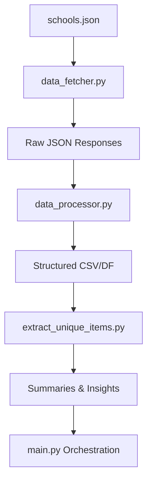

# School Menu Data Pipeline

This repository provides a complete **data ingestion and processing pipeline** for fetching, cleaning, and analyzing **school meal menu data** for the **Fairfax County Public Schools (FCPS)** district.  

It integrates API calls, local JSON configuration, and data processing scripts to build structured datasets for further analysis or dashboarding.

---

##  Project Structure

```
.
├── config.py
├── data_fetcher.py
├── data_processor.py
├── extract_unique_items.py
├── main.py
├── schools.json
```

---

##  1. `config.py`

### Purpose
Defines core **configuration constants** used across all modules:
- **Base URLs**
- **API headers**
- **District identifiers**
- **Logging and paths**

### Example Contents
```python
BASE_URL = "https://api.linqconnect.com/api/FamilyMenu"
DISTRICT_ID = "019aa8c9-09f1-ee11-a85e-985e1ae32d4b"
HEADERS = {
    "Linq-Nutrition-Url": "...",
    "Origin": "https://linqconnect.com",
    "User-Agent": "Mozilla/5.0 ..."
}
```

These constants are imported by other scripts to ensure consistent configuration.

---

##  2. `data_fetcher.py`

### Purpose
Handles **API communication** with the LinqConnect service.

### Key Functions
- **`fetch_menu_data(building_id, start_date, end_date)`**  
  Fetches menu data for a given school and date range.

- **`generate_date_ranges(start_year, months)`**  
  Generates monthly date ranges (e.g. Aug–May for a school year).

### Workflow
1. Load district and building IDs from `schools.json`.
2. Loop through each building.
3. For each month, call the LinqConnect API.
4. Store responses in local JSON/CSV files for later processing.

---

##  3. `data_processor.py`

### Purpose
Cleans and structures the raw JSON responses from `data_fetcher.py`.

### Common Operations
- Extract menu items, nutrients, and categories.
- Flatten nested JSON fields.
- Remove duplicates and null entries.
- Output structured DataFrames or CSVs.

### Example Usage
```python
from data_processor import process_raw_data

processed_df = process_raw_data("raw_data.json")
processed_df.to_csv("cleaned_menus.csv", index=False)
```

---

##  4. `extract_unique_items.py`

### Purpose
- Extracts **unique menu items** and **nutrient features** across all schools.
- Reads your CSV file with all the nutrition data
- Extracts unique items by RecipeID (deduplication)
- Creates clean output with only nutrition information
- Saves two files:

fairfax_unique_menu_items_YYYYMMDD_HHMM.csv
fairfax_unique_menu_items_YYYYMMDD_HHMM.json

### Outputs
- List of all unique **menu item names**.
- List of available **nutritional attributes** (e.g. Calories, Protein).
- Optionally, summary stats by category or date.

### Example Output
```text
Unique menu items: 420
Nutrients found: ['Calories', 'Protein', 'Total Fat', ...]
```

---
### Example Run

Basic Usage 
python extract_unique_items.py --input "your_nutrition_data.csv"

With custom output name:
python extract_unique_items.py --input "nutrition_data.csv" --output "fcps_menu_items"

## 5. `main.py`

### Purpose
Serves as the **entry point** for the entire pipeline.

### Workflow
1. Imports configuration from `config.py`.
2. Uses `data_fetcher.py` to get raw data.
3. Calls `data_processor.py` to clean and structure data.
4. Saves results to disk.
5. Next , load the generated csv file to inspect.
6.Optionally run  `extract_unique_items.py` to extract  unique items.

### Example Run
```bash
python main.py
```

---

##  6. `schools.json`

Contains metadata for all buildings in the **Fairfax County Public Schools** district:

```json
{
  "DistrictId": "019aa8c9-09f1-ee11-a85e-985e1ae32d4b",
  "DistrictName": "Fairfax County Public Schools",
  "Buildings": [
    { "BuildingId": "f3814b43-47f3-ee11-a85d-c1cdae737fb9", "Name": "Aldrin Elementary" },
    ...
  ],
  "MenuNotification": "Menus are subject to change due to food availability..."
}
```

This file is used to map **school names to Building IDs** for API queries.

---

## 🧠 Data Flow Summary



---
## Requirements

Required Python packages:

```bash
pip install numpy pandas requests requests python-dateutil pytz tqdm
```

##  Installation

```bash
git clone <repo-url>
cd <repo-folder>
python3 -m venv venv
source venv/bin/activate
```

---

## ▶ Usage

### Run Entire Pipeline
```bash
python main.py
```

### Run Individual Modules
```bash
python data_fetcher.py
python data_processor.py
python extract_unique_items.py
```

---


